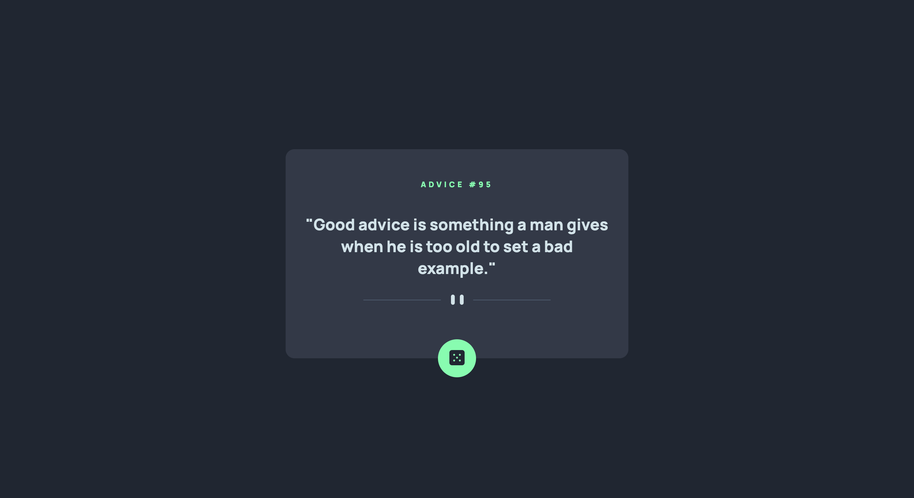
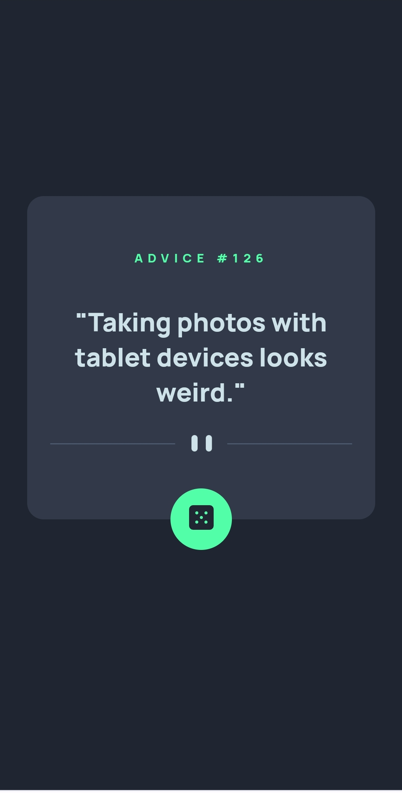

# Frontend Mentor - Advice generator app solution

This is a solution to the [Advice generator app challenge on Frontend Mentor](https://www.frontendmentor.io/challenges/advice-generator-app-QdUG-13db). Frontend Mentor challenges help you improve your coding skills by building realistic projects.

## Table of contents

- [Overview](#overview)
  - [The challenge](#the-challenge)
  - [Screenshot](#screenshot)
  - [Links](#links)
- [My process](#my-process)
  - [Built with](#built-with)
- [Author](#author)


### The challenge

Users should be able to:

- View the optimal layout for the app depending on their device's screen size
- See hover states for all interactive elements on the page
- Generate a new piece of advice by clicking the dice icon


### Api Request
```js
function getApi(){
    fetch('https://api.adviceslip.com/advice/' + Math.floor(Math.random() * 200))
    .then(res => res.json())
    .then(res =>  {
        document.getElementById("phrase").innerHTML= '"' + res.slip.advice + '"'
        document.getElementById("id").innerHTML= 'ADVICE #'+ res.slip.id
    })
    .catch(err => console.log(err))
}
```


### Screenshot





### Links

- Solution URL: [here](https://github.com/HectorMartinDama/adviceGeneratorApp)
- Live Site URL: [here](https://advice-generator-app-ten-xi.vercel.app/)

### Built with

- Flexbox
- CSS Grid
- Mobile-first workflow
- [SASS/SCSS](https://sass-lang.com/) - SASS

## Author

- Frontend Mentor - [@HectorMartinDama](https://www.frontendmentor.io/profile/HectorMartinDama)
- Linkedin - [@Héctor Martín](http://linkedin.com/in/héctor-martín-a88a761a2)
